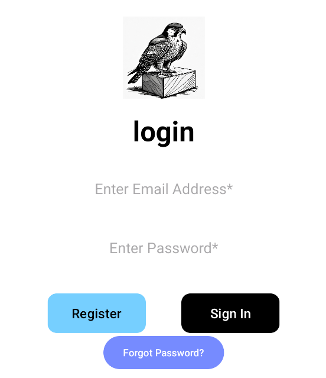
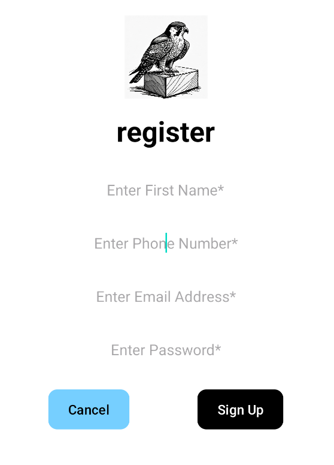

# PeregrineInventory: Mobile Android Inventory App

### Summary

PeregrineInventory is a mobile Android app developed to streamline inventory tracking for businesses of all sizes. Originally built as part of the CS360 course, this app addresses key user needs by providing efficient inventory management, secure user authentication, robust database integration, and real-time SMS notifications. With a user-friendly interface, PeregrineInventory ensures accurate tracking of inventory levels and timely alerts for low stock or other important events.

### Screens and Features

To deliver a seamless user experience, PeregrineInventory includes several intuitive screens and features:

- **Login Screen:**  
  Secure login functionality that allows users to access existing accounts or create new ones.

- **Dashboard:**  
  An overview screen displaying inventory statistics, upcoming events, and notifications for quick insights.

- **Inventory Management:**  
  A comprehensive module that enables users to add, edit, delete, and view detailed information for each inventory item.

- **SMS Notifications:**  
  Real-time SMS alerts notify users when inventory levels drop to critical levels or when key events occur.

- **Additional Enhancements:**  
  - **Bulk Deletion:** A "Delete All Items" feature complete with confirmation dialogs for safe mass removal.  
  - **Forgot Password:** A secure recovery system allowing users to reset their credentials if forgotten.  
  - **Database Operations:** Improved bulk operations and enhanced record management using SQLite.

These features are designed with simplicity, intuitiveness, and accessibility in mind, ensuring users can manage their inventory without unnecessary complexity or confusion.

### Coding Approach

The app was developed using a modular programming approach within an MVC architecture, ensuring both reusability and maintainability. Key aspects of the coding strategy include:

- **Modular Design:**  
  Breaking the application into distinct, reusable components (e.g., separate classes for deleting items and managing SMS notifications).

- **Clean Code Practices:**  
  Emphasis on comprehensive code documentation, robust error handling, and adherence to best practices, ensuring the codebase remains reliable and easy to maintain.

- **Technology Stack:**  
  Built with Android Studio, Java, and SQLite, the app leverages industry-standard tools and practices to create a scalable, full-stack mobile solution.

### Testing Process

A rigorous testing process was undertaken to ensure the app meets performance and reliability standards. This process included:

- **Unit Testing:**  
  Extensive unit tests were written to verify the functionality of individual components.

- **Real-Device Testing:**  
  The app was run on an actual mobile device to identify and resolve issues related to user authentication, database synchronization, and overall app performance.

- **Bug Fixes:**  
  Testing revealed challenges such as login authentication failures and database synchronization errors, which were promptly addressed to enhance stability and usability.

### Innovation and Challenges

Developing PeregrineInventory presented several innovative challenges:

- **Real-Time SMS Notifications:**  
  Implementing SMS functionality in real time required overcoming Android's stringent security and permission protocols. This challenge deepened my understanding of Android API integration and user privacy management.

- **Seamless Feature Integration:**  
  Integrating new features like bulk deletion and password recovery with the existing app logic demanded careful planning, precise coding, and thorough testing to ensure a cohesive and reliable user experience.

### Demonstrated Knowledge and Skills

PeregrineInventory showcases a broad range of technical skills and knowledge, including:

- **Backend Development and API Integration:**  
  The secure authentication system and robust database integration highlight my expertise in creating scalable backend solutions.

- **User Interface Design:**  
  A focus on a user-centered design ensures that the app is both intuitive and responsive, providing an optimal experience for users.

- **Full-Stack Development:**  
  The project demonstrates my ability to develop complete mobile applications—from front-end UI to backend logic—using modern development tools and best practices.

- **Problem Solving and Adaptability:**  
  Overcoming challenges such as real-time SMS integration and complex database operations reflects my capacity to innovate and adapt in a dynamic development environment.

## Demonstrated Knowledge and Skills
The successful implementation of user authentication and database integration components showcased my knowledge and skills in backend development and API integration. By designing a robust and secure authentication system and seamlessly integrating database operations, I demonstrated proficiency in full-stack development and delivering scalable, reliable applications.
  
 
  
 
  
 
  
 
